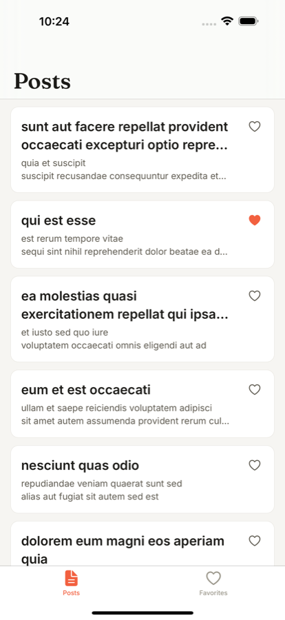
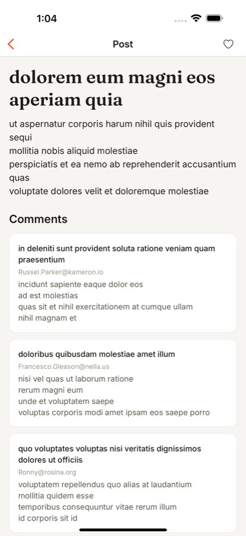
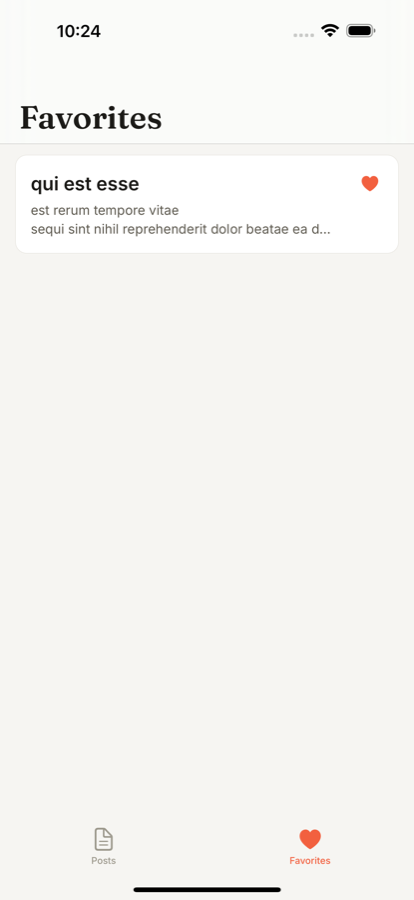
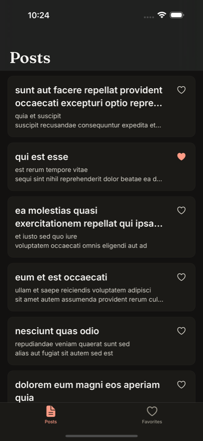
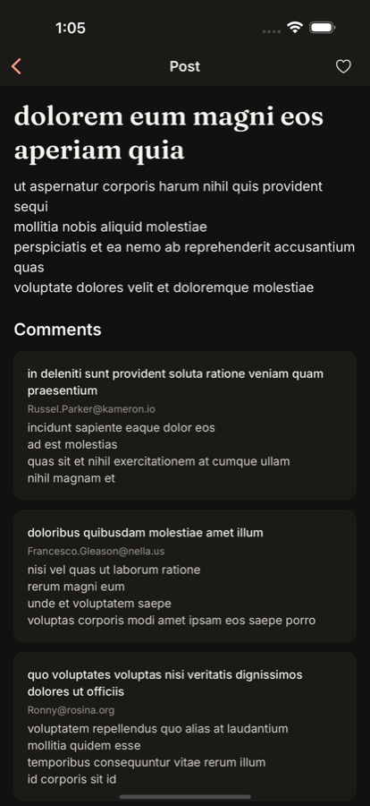
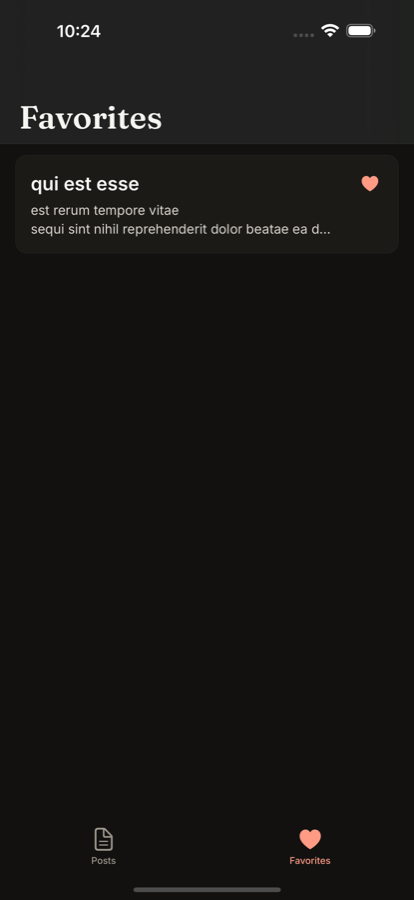

# Posty

A managed Expo app that lists [jsonplaceholder](https://jsonplaceholder.typicode.com) Posts, shows a
Post with its Comments, searches by title, and keeps Favorites that work offline. It runs as a
development build (no Expo Go), with three side-by-side Variants, a token-driven design system,
and CI that builds and runs end-to-end tests on both platforms for every pull request.

|       | Posts                                                      | Post detail                                                 | Favorites                                                      |
| ----- | ---------------------------------------------------------- | ----------------------------------------------------------- | -------------------------------------------------------------- |
| Light |  |  |  |
| Dark  |   |   |   |

## Who did what

This project was built in two phases, on purpose:

- **Foundation — designed and built entirely by the human.** Architecture and folder structure,
  the Axios networking layer, server state with TanStack Query, client state with Zustand and
  MMKV, the design token pipeline, the three Variants and env validation, the base tests, and CI/CD
  (GitHub Actions and EAS, with fingerprint reuse and Maestro).
- **Features — implemented by the AI** from specs and tickets the human wrote: the Posts list,
  search, Post detail, Favorites (toggle, sync, offline tab) and deep links. Each feature landed as
  a pull request with tests and Maestro flows, reviewed against the repo's standards and its ticket,
  and was verified on the iOS simulator and in CI before merging.

## Getting started

Requirements: [Bun](https://bun.sh), Xcode (iOS) and/or Android Studio (Android). The app needs a
development build; it does not run in Expo Go.

```bash
bun install
```

**Without access to the project's EAS account** (most reviewers): copy the example env file and
run Expo directly. It only holds the public API URL and the Variant, nothing secret.

```bash
cp .env.example .env
bunx expo run:ios        # or: bunx expo run:android
```

**With access to the EAS account:** sign in (`bunx eas-cli login`) and use the scripts, which pull
the Variant's environment from EAS into `.env` before running:

```bash
bun run ios              # development Variant on the iOS simulator
bun run android          # development Variant on an Android emulator
```

With `buildCacheProvider: 'eas'`, a native build matching the local fingerprint is downloaded from
EAS when one exists, so most runs skip the native compile. Without an EAS session it simply builds
locally.

**Secrets:** none are committed. `.env` is git-ignored, and CI reads the Expo token only from the
`EXPO_TOKEN` GitHub Actions secret, which forks and pull requests from forks cannot read. To run CI
in your own fork, create an Expo access token and add it as that secret.

### Variants

| Variant     | App name      | Scheme           | Run locally                                   |
| ----------- | ------------- | ---------------- | --------------------------------------------- |
| development | Posty (Dev)   | `posty-dev://`   | `bun run ios` / `bun run android`             |
| staging     | Posty (Stage) | `posty-stage://` | `bun run ios:stage` / `bun run android:stage` |
| production  | Posty         | `posty://`       | EAS `production` profile                      |

Each Variant has its own bundle ID, name, icon badge and scheme, so all three install side by side.
Staging is a Release build for simulators and emulators; CI tests this binary.

### Design system

The look of the app is data, not code. A design system is a folder of
[W3C design tokens](https://www.designtokens.org/) (the JSON format Figma Variables and Tokens
Studio export), and a script turns it into typed Unistyles themes. Two ship with the repo:
`design-systems/posty` (the default) and `design-systems/lagoon`.

```
design-systems/posty/
  manifest.json          name, which files are themes and shared tokens, fonts to bundle
  tokens/primitives.json raw values: the color palette (ink, coral, rose…)
  tokens/scales.json     space and radius scales
  tokens/typography.json font families, sizes, line heights and text styles
  tokens/posty-light.json semantic colors for light: bg, text, border, accent, favorite
  tokens/posty-dark.json  the same keys for dark
  fonts/                 the font files the manifest declares
```

- **Three layers.** Primitives hold raw values. Semantic tokens give them a meaning per theme by
  referencing them (`"text.accent": "{palette.coral.500}"`). Scales and typography are shared by
  both themes. Components only ever see the semantic names, so a theme or a whole design system can
  change without touching them.
- **`bun run ds:apply --ds=<name>`** validates the folder and writes `src/design-system/generated/`
  (themes, fonts, style-prop maps) and copies the fonts to `assets/fonts/`. It fails, without
  writing anything, if a file is missing, an alias doesn't resolve, a required group (`space`,
  `radius`, `fontFamily`, `fontSize`, `lineHeight`, `typography`, and `color` in each theme) is
  absent, the light and dark themes don't have the same keys, or a text style uses a font the
  manifest doesn't declare.
- **Themes are always called `light` and `dark` in the app**, whatever the design system names them,
  so Unistyles' adaptive themes and the navigation theme follow the device setting with no code
  changes.
- **Style props take token keys, never raw values** (`<Text variant="title" color="secondary">`,
  `<Box padding="md" bg="surface">`), typed from the generated maps.
- `bun run ds:check` fails when the generated files don't match the design system (CI runs it), and
  EAS builds apply the one named in the `DESIGN_SYSTEM` env of `eas.json` (`posty`).

**Creating a new design system:** copy `design-systems/posty` to `design-systems/<name>`, set
`name` in its `manifest.json`, change the values (keep the same semantic keys, since components use
them), drop your fonts in `fonts/` and list them in the manifest, then run
`bun run ds:apply --ds=<name>` and fix whatever it reports. Try `--ds=lagoon` to see a whole
re-skin; `--ds=posty` brings the default back.

### Tests

```bash
bun run check          # ds:check + typecheck + lint + unit/integration tests (what CI runs)
bun run test           # Jest only
bun run ios:stage      # install the staging app first: the E2E scripts target it
bun run e2e:ios        # Maestro flows against the installed staging app
bun run e2e:android
```

- **Unit and integration:** Jest + React Native Testing Library, with the API mocked at the network
  level by MSW, so tests go through the real Axios client, interceptors and Zod schemas.
- **End to end:** Maestro flows per platform in `.maestro/` (list and paging, search → detail with
  comments, favorites, the Favorites tab, deep links on cold and warm start).

### CI

Every pull request to `main` (and every push to it) runs on GitHub Actions:

1. `check` (design-system drift, typecheck, lint, tests).
2. Per platform: compute the native fingerprint. If a staging build for it already exists (GitHub
   cache, then EAS), reuse it and repack it with the new JS; otherwise build it, on the GitHub
   runner by default or on EAS when the `BUILD_RUNNER` repository variable is `eas`. The artifact
   link is posted on the PR.
3. Per platform: install that artifact on an emulator (Ubuntu) or simulator (macOS) and run the
   Maestro flows; videos and JUnit reports are uploaded and summarized on the PR.

### Known CI issues

The end-to-end jobs run on GitHub-hosted runners, and they have been unreliable for reasons
outside the app. Pull requests #6 to #10 (Post detail, Favorites, the Favorites tab, deep links and
this README) were merged on purpose without waiting for green end-to-end checks; each feature's
Maestro flows were run on the iOS simulator against a Release staging build before merging, and
on Android only in CI. What we found, and what was done about it:

- **Android emulator dropped its connection mid-run.** On the `google_apis` system image, Google
  Play services update system modules a few minutes after boot, which restarted adb (`device
offline`) between flows. The job now uses the `default` image, which has no Play services (the
  app needs none); after that change the Android flows passed in every run that started. One later
  run failed before starting because the runner downloaded a corrupt system image.
- **The CI emulator's screen was small (320×640).** Assertions on content below the fold failed;
  flows now scroll to it, and the emulator now uses the Pixel 7 profile with its launcher
  disabled (a fresh emulator's launcher can hang and cover the app), as in a sibling project whose
  Android flows are stable.
- **iOS simulators on hosted macOS runners are slow and sometimes never start Maestro's driver.**
  We saw jobs never get a macOS runner at all (capacity), the driver time out after several
  minutes, and simple flows take two minutes instead of seconds. The job now pins Xcode 26.5, runs
  on the newest runtime's iPhone 17 Pro (the setup that is stable in a sibling project), opens the
  app once to absorb the simulator's first-boot work, and waits up to four minutes for the driver.
  These changes have not yet been proven with three consecutive green runs, so an iOS end-to-end
  failure in CI should be read as likely infrastructure until its logs say otherwise.
- **A timing bug in the search flow.** It waited for a result that was already on the unfiltered
  list; it now waits for a non-matching Post to disappear.

## Architecture

```
src/
  app/            Expo Router routes only (thin: each exports a screen)
  features/
    posts/        api, model, hooks, components, controllers, screens
    favorites/    store, hooks, components, controllers, screens
  shared/         api (Axios + ApiError), query, components, lib
  design-system/  generated themes, Unistyles setup, navigation theme
  config/         Variant + env validation
```

Key decisions (the full ADRs are kept out of the repository):

- **Feature folders with one direction of dependency:** `app → features → shared`, enforced by
  ESLint. Components are presentational; controllers own state, queries and navigation; screens only
  place a controller.
- **Networking:** a single Axios client in `shared/api`. Every failure becomes a typed `ApiError`
  (`network`, `timeout`, `http`, `parse`) and every response is validated with Zod.
- **Server state:** TanStack Query with a key factory per feature. The list is an infinite query
  (20 per page, total from `X-Total-Count`) keyed by the debounced, regex-escaped search. The detail
  is one request, `/posts/:id?_embed=comments`, cached for five minutes so revisits are instant.
- **Client state:** Favorites are the only persisted state, in Zustand over MMKV, versioned with a
  migration. They store snapshots of the Posts (and Comments, once the detail was opened), so the
  Favorites tab and a Favorite's detail render offline with an "Offline · updated X ago" notice.
  Screens that fetch Posts refresh those snapshots explicitly.
- **Navigation:** a root stack holds the native tabs (Posts and Favorites, each with its own
  stack and native header search) and, above them, the single Post detail route `/posts/:id`.
  The stack is anchored to the tabs, so a deep link opened on a cold start still has them
  underneath and back returns to the list. Links (`posts/:id`, `favorites`,
  `favorites/posts/:id`) work on cold and warm start; an invalid or missing Post shows "Post not
  found" with a button back out.
- **Strict TypeScript:** `strict`, `noUncheckedIndexedAccess`, `exactOptionalPropertyTypes`, and
  `any` banned by ESLint. Type assertions are avoided by convention (Zod parsing and type guards
  instead), not by a lint rule.
